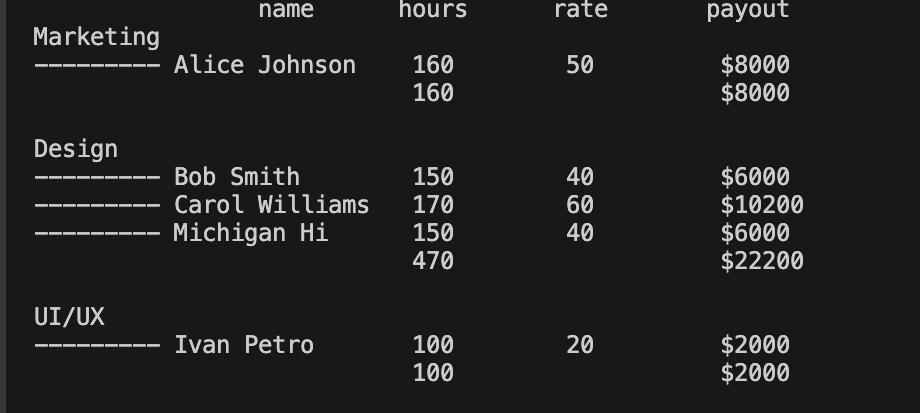

# 🐍 python script report


You can use this script to output a report on these issues and view the total number of hours and payments by department.

## 🚀 Start
You can create your own csv file or modify existing ones while maintaining the structure

 1. start script
 for example 
```
python3 main.py cs.csv cs2.csv --report payout 
```
 2. result
 

 <p align="center">
 
</p>
